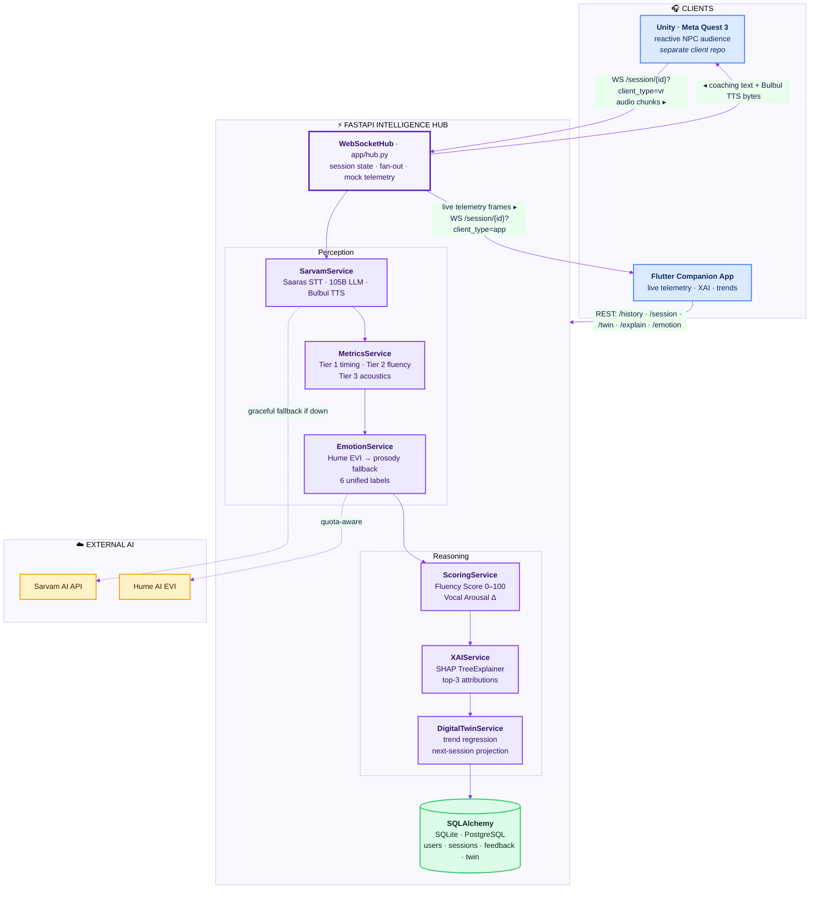
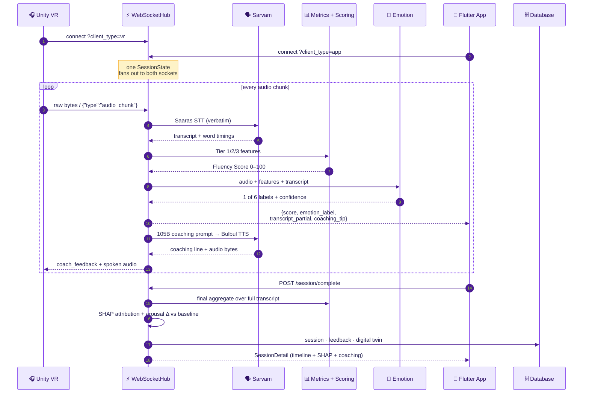
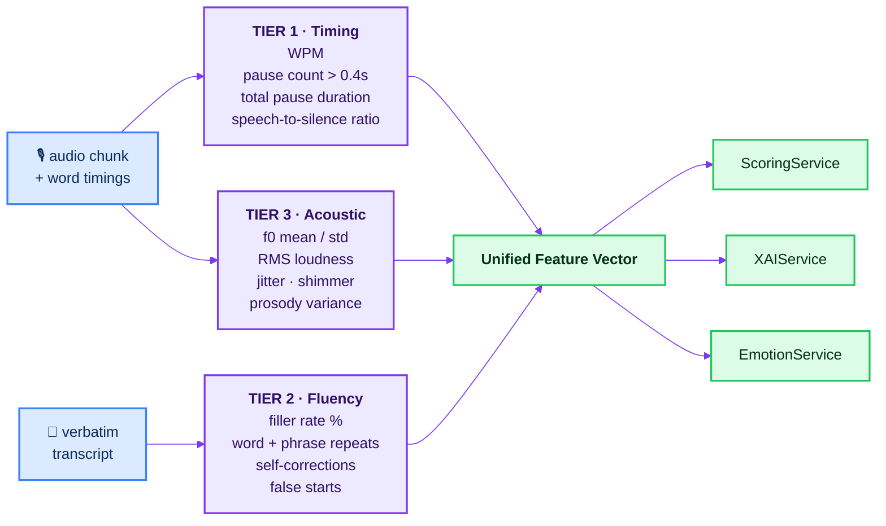
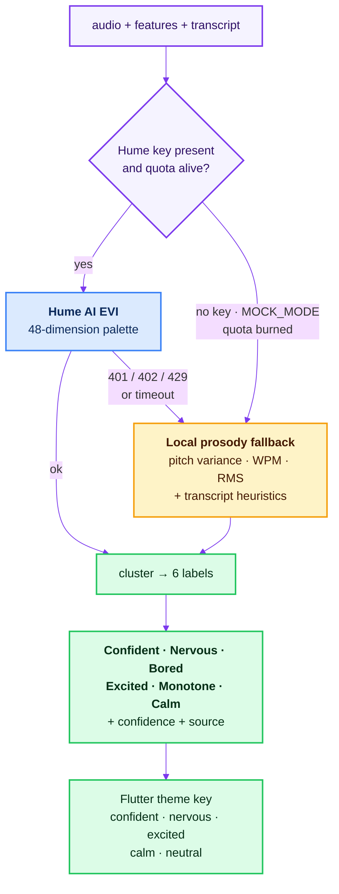
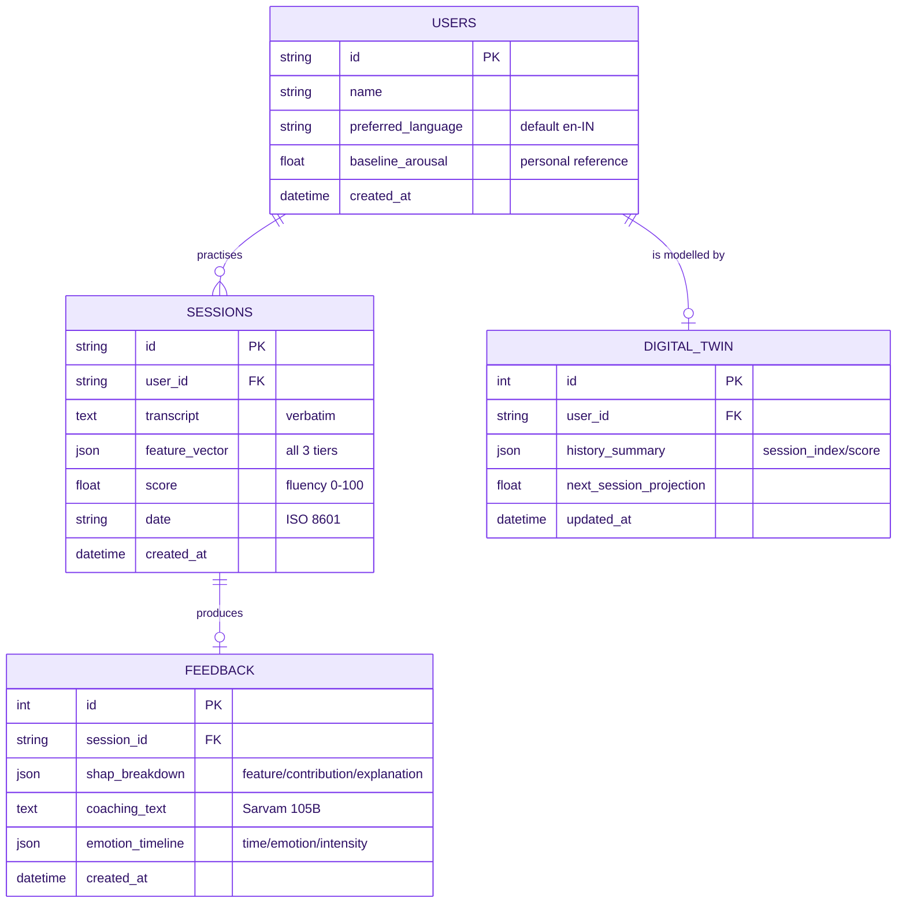

<div align="center">

# अनुभव · Anubhav

### The VR Public Speaking Coach that listens in 22 Indian languages — and explains every point it gives you.

Speak to a live VR audience. Anubhav transcribes you *verbatim* (fillers and all), reads your
vocal emotion, scores your delivery, tells you **exactly which habit cost you which points**, and
tracks the version of you that is getting better, session after session.

<br/>

[](https://www.python.org/)
[](https://fastapi.tiangolo.com/)
[](https://flutter.dev/)
[](https://scikit-learn.org/)
[](https://shap.readthedocs.io/)
[](https://www.sarvam.ai/)
[](#-testing)
[](LICENSE)

**Team Kaala Teeka ▪️ · graVITas'26**

</div>

---

## 📖 Table of Contents

| | | | |
|---|---|---|---|
| [Why Anubhav](#-why-anubhav) | [System Architecture](#-system-architecture) | [A Session, End to End](#-a-session-end-to-end) | [The Intelligence Stack](#-the-intelligence-stack) |
| [Scoring & Explainability](#-scoring--explainability) | [Data Model](#-data-model) | [API Reference](#-api-reference) | [Flutter Companion App](#-the-flutter-companion-app) |
| [Repository Layout](#-repository-layout) | [Quickstart](#-quickstart) | [Configuration](#-configuration) | [Demo / Mock Mode](#-demo--mock-mode) |
| [Testing](#-testing) | [Roadmap](#-roadmap) | [Disclaimer](#-disclaimer) | [License & Credits](#-license--credits) |

---

## ✦ Why Anubhav

Public speaking tools tell you *what* your score is. Almost none tell you **why** — and virtually
none of them listen to an Indian speaker switching between English and Hindi mid-sentence.

Anubhav is built around four commitments:

| Commitment | What it means in the code |
|---|---|
| 🗣 **Speak how you actually speak** | Sarvam **Saaras** STT runs in **verbatim mode** — `matlab`, `um`, `basically`, repeats and false starts are *deliberately preserved*, because they are the signal, not noise. |
| 🔍 **No black-box scores** | Every score ships with a **SHAP** attribution: `Filler Words −8.3 pts`, `Speaking Pace +6.1 pts`, each with a sentence a human can act on. |
| 📉 **Compared to you, not to a population** | The **Vocal Arousal Index** is a *delta from your own baseline session*, never a fixed threshold. |
| 🔌 **Never dies on stage** | Every external dependency — Sarvam, Hume, the SHAP model, the network — has a working local fallback. A judge with no Wi-Fi still gets a full demo. |

---

## ✦ System Architecture

Two clients, one hub. The **FastAPI Intelligence Hub** is the single point where audio becomes
insight — and the only place that talks to third-party AI.



> **Note** — this repository contains the **backend hub** (`backend/`) and the **Flutter companion
> app** (`frontend/`). The Unity/Quest client is a sibling project that connects to the same
> WebSocket contract documented in [API Reference](#-api-reference).

---

## ✦ A Session, End to End

What actually happens between "you start talking" and "you see why your score moved".



---

## ✦ The Intelligence Stack

### 1 · Multilingual Speech Intelligence — `SarvamService`

Every Sarvam call lives in exactly one file (`app/services/sarvam_service.py`), so the whole
pipeline can be mocked, swapped, or rate-limited from one place.

| Stage | Model | What it does here |
|---|---|---|
| **STT** | `saaras:v1`, `mode=verbatim` | 22 Indian languages + English. Verbatim mode keeps fillers, repeats and false starts — the raw material for Tier 2 metrics. Returns per-word `start_time` / `end_time` used for pause detection. |
| **LLM** | `sarvam-105b` | `build_coaching_prompt()` fuses transcript + emotion + score + last 3 sessions, and *forbids* generic praise: quote a real phrase, give exactly one actionable vocal tip, stay under 35 words. |
| **TTS** | `bulbul:v1` | Speaks the coaching line back into the headset in the speaker's own language, pace-controlled. |

Every method has a mock branch (`MOCK_MODE=True` or no API key) that returns realistic
Hinglish transcripts, quotable coaching lines, and a valid 16 kHz WAV stub — so the demo never
depends on a network.

### 2 · Three-Tier Voice & Speech Metrics — `MetricsService`



- **Tier 2 vocabulary is Indian-English aware**: alongside `um`, `uh`, `like`, `basically`, it
  detects `matlab`, `yaani`, `dekho`, `i mean`, `you know`, `sort of`, `so yeah`.
- **Tier 3 degrades in three steps**: Praat/Parselmouth (jitter, shimmer, true f0) →
  `soundfile` + NumPy RMS → calibrated baseline constants. The response always carries
  `is_fallback` so downstream consumers know which path ran.

### 3 · Dual-Path Emotion Sensing — `EmotionService`



Once Hume returns `401/402/429`, the service latches `_quota_exhausted` and stops retrying for
the process lifetime — a burned free tier can never stall a live session. **Whichever path runs,
the output vocabulary is identical**, so no client ever has to branch on the source.

### 4 · Persistent Digital Twin — `DigitalTwinService`

Fits least-squares regression across every stored session score, exposes the **slope** (are you
improving?) and a clamped **next-session projection** (30–98). One session → conservative `+3`
projection. Zero sessions → a demo trajectory so the app never renders an empty chart. The
service is written as a clean seam: swap `np.linalg.lstsq` for Prophet/ARIMA without touching a
route.

---

## ✦ Scoring & Explainability

### The Speech Fluency Score (0–100)

A weighted blend of five sub-scores, every weight overridable from `.env`:

| Sub-score | Weight | Rewarded | Penalised |
|---|:--:|---|---|
| **Continuity** | `0.25` | 130–155 WPM = 100 | falls off linearly either side; floor 35 |
| **Pause control** | `0.20` | avg pause 0.4–1.2 s = 95 | dead air > 1.2 s, −25/s; rushed < 0.4 s = 80 |
| **Filler rate** | `0.25` | ≤ 1.0 % = 100 | steepens past 3 %, hard floor 20 at > 6 % |
| **Repetition** | `0.15` | none | −12 per repeat |
| **Self-correction** | `0.15` | none | −15 per false start |

### The Vocal Arousal Index

```
session 1  →  Δ = 0.0,  your raw arousal becomes your baseline
session n  →  Δ = arousal_now − your_baseline
              Δ > +0.15  "Elevated"   ·  Δ < −0.15  "Subdued"  ·  else "Stable"
```

Your baseline lives on your `users` row. You are never compared to anyone else.

### SHAP — where the points actually went

A `GradientBoostingRegressor` (`n_estimators=80`, `max_depth=4`, `lr=0.08`) is trained offline by
`ml/train_scorer.py` on 600 synthetic delivery vectors whose ground truth encodes non-linear
pacing, filler, pause, repetition and prosody penalties. Reference training run:
**R² ≈ 0.92, MAE ≈ 2.9 pts** — the script prints its own metrics on every run and stores them
inside `scorer.pkl`.

`shap.TreeExplainer` then attributes a single delivery across eight features:

| Model feature | Shown to the user as |
|---|---|
| `wpm` | Speaking Pace (WPM) |
| `filler_rate` | Filler Words |
| `pause_count` | Pause Frequency |
| `total_pause_duration` | Pause Duration |
| `rms_loudness` | Vocal Projection |
| `prosody_variance` | Pitch Modulation |
| `repetition_count` | Word Repetitions |
| `self_correction_count` | False Starts |

The top 3 by absolute impact are turned into plain sentences:

```jsonc
[
  { "feature": "Filler Words",        "contribution": -8.3,
    "explanation": "High filler density (4.2% fillers like 'um'/'like') lowered your score by 8.3 points." },
  { "feature": "Speaking Pace (WPM)", "contribution":  6.1,
    "explanation": "Ideal cadence (142 WPM) maintained audience engagement and boosted your score by 6.1 points." },
  { "feature": "Pause Duration",      "contribution":  4.5,
    "explanation": "Deliberate pause placement (4.8s total) gave key arguments time to sink in (+4.5 points)." }
]
```

> If `scorer.pkl` is missing or SHAP fails to initialise, `XAIService` falls back to **analytical
> attributions** with the same contract — the explainability panel never goes blank.

---

## ✦ Data Model



---

## ✦ API Reference

Base URL `http://localhost:8000` · interactive docs at **`/docs`** · OpenAPI at `/openapi.json`.

| Method | Path | Purpose |
|---|---|---|
| `WS` | `/session/{id}?client_type=vr\|app` | Dual-party live session channel |
| `POST` | `/session/complete` | Finalise: metrics → SHAP → twin → persist |
| `GET` | `/session/{id}` | Full session report (timeline + SHAP + coaching) |
| `GET` | `/history/{user_id}` | Session summaries, newest first |
| `GET` | `/twin/{user_id}` | Trend, slope, next-session projection |
| `GET` | `/emotion` | Unified emotion reading (query-parameterised) |
| `GET` | `/explain` | SHAP breakdown for a session |
| `GET` | `/` · `/health` | Service status, contract map, disclaimer |

### WebSocket contract

**Inbound** (from Unity VR): raw binary audio frames, or JSON —

```jsonc
{ "type": "audio_chunk", "data": "<base64 wav>" }   // decoded then transcribed
{ "type": "text_chunk",  "text": "spoken text" }    // skips STT, useful for testing
{ "type": "ping" }                                   // → { "type": "pong" }
```

**Outbound → Flutter app** (telemetry frame, ~every chunk):

```json
{
  "score": 76,
  "emotion_label": "confident",
  "transcript_partial": "Basically our architecture solves the latency issue...",
  "coaching_tip": "Maintain steady cadence",
  "is_final": false,
  "disclaimer": "All metrics are model-derived proxies..."
}
```

**Outbound → Unity VR**: a `coach_feedback` JSON frame followed by raw **Bulbul TTS audio bytes**.

```json
{ "type": "coach_feedback", "score": 76, "emotion": "Confident",
  "coaching_text": "Notice how 'matlab' clustered there. Hold a silent 1-second pause instead." }
```

### `POST /session/complete`

<table>
<tr><th>Request</th><th>Response (abridged)</th></tr>
<tr><td>

```json
{
  "session_id": "s001",
  "user_id": "user_001",
  "final_transcript": "Good morning..."
}
```

</td><td>

```json
{
  "status": "completed",
  "session": {
    "overall_score": 74,
    "emotion_timeline": [...],
    "shap_breakdown": [...],
    "coaching_text": "...",
    "feature_vector": {...}
  },
  "disclaimer": "..."
}
```

</td></tr>
</table>

### `GET /twin/{user_id}`

```json
{
  "user_id": "user_001",
  "history_summary": [ {"session_index": 1, "score": 68}, {"session_index": 2, "score": 74} ],
  "next_session_projection": 81.0,
  "trend_slope": 5.5,
  "baseline_arousal": 0.52,
  "disclaimer": "..."
}
```

---

## ✦ The Flutter Companion App

A dark, violet-accented second screen for the person holding the phone while you present.

| Screen | What's on it |
|---|---|
| **Live Dashboard** | Animated radial `ScoreGauge`, pulsing live indicator, colour-coded `EmotionBadge`, auto-scrolling `TranscriptFeed`, and a `ConnectionStatusBanner` that surfaces reconnect state honestly. |
| **Session History** | Every past session with headline score, served from cache first so the list never blanks offline. |
| **Session Detail** | `fl_chart` emotion timeline (area), horizontal SHAP contribution bars (green up / red down), and the Digital Twin trend line with the projected next session. |

**Engineering notes**

- `provider` + `ChangeNotifier` for state — `Session`, `History`, `Detail`, `Twin`.
- `WebSocketService` hides all reconnection: exponential backoff `1s → 2s → 4s …` capped at `30s`,
  exposed to the UI only as `connected / reconnecting / disconnected`.
- `CacheService` (`shared_preferences`) persists the last history list and last live
  score/emotion/transcript.
- `MockDataService` mirrors the API contract field-for-field, so flipping one boolean switches the
  whole app from canned data to the live hub with **zero model changes**.
- Theme is the single source of emotion→colour truth (`emotionColors`) plus score bands
  (≥80 green · ≥60 amber · else red), typeset in Outfit via `google_fonts`.

---

## ✦ Repository Layout

```
Anubhav/
├── backend/                              # FastAPI Intelligence Hub
│   ├── app/
│   │   ├── main.py                       # App factory, CORS, router mounting, /health
│   │   ├── hub.py                        # WebSocketHub + SessionState + mock telemetry loop
│   │   ├── config.py                     # Pydantic Settings, scoring weights, disclaimer
│   │   ├── db/
│   │   │   ├── database.py               # Engine, SessionLocal, get_db, init_db
│   │   │   └── models.py                 # User · Session · Feedback · DigitalTwin
│   │   ├── routes/
│   │   │   ├── session.py                # WS /session/{id} · POST /complete · GET /{id}
│   │   │   ├── history.py                # GET /history/{user_id}
│   │   │   ├── twin.py                   # GET /twin/{user_id}
│   │   │   ├── emotion.py                # GET /emotion
│   │   │   └── explain.py                # GET /explain
│   │   ├── services/
│   │   │   ├── sarvam_service.py         # Saaras STT · 105B LLM · Bulbul TTS (+ mocks)
│   │   │   ├── metrics_service.py        # Tier 1 / 2 / 3 feature extraction
│   │   │   ├── scoring_service.py        # Fluency Score · Vocal Arousal Δ
│   │   │   ├── emotion_service.py        # Hume EVI + local prosody fallback
│   │   │   ├── xai_service.py            # SHAP TreeExplainer + analytical fallback
│   │   │   └── digital_twin_service.py   # Trend regression + projection
│   │   └── schemas/                      # Pydantic contracts shared with Flutter & Unity
│   ├── ml/
│   │   ├── train_scorer.py               # Synthetic data generation + training
│   │   ├── synthetic_dataset.csv         # 600 labelled delivery vectors
│   │   └── scorer.pkl                    # GradientBoostingRegressor + metrics + version
│   ├── tests/                            # 26 pytest cases across services and API
│   ├── .env.example
│   └── requirements.txt
│
├── frontend/                             # Flutter companion app
│   └── lib/
│       ├── main.dart · app.dart          # Entry, portrait lock, routes, providers
│       ├── config/api_config.dart        # useMockData toggle, base/WS URLs, backoff
│       ├── models/                       # SessionSummary · SessionDetail · ShapFeature …
│       ├── providers/                    # Session · History · Detail · Twin
│       ├── screens/                      # HomeShell · LiveDashboard · History · Detail
│       ├── services/                     # Api · WebSocket · Cache · MockData
│       ├── widgets/                      # ScoreGauge · EmotionBadge · SHAP bars · charts
│       └── theme/app_theme.dart          # Emotion→colour map, score bands, typography
│
├── LICENSE                               # MIT
└── README.md
```

---

## ✦ Quickstart

### Backend — FastAPI hub

```bash
cd backend

python3.11 -m venv .venv && source .venv/bin/activate   # 3.10–3.12; 3.11 recommended
pip install -r requirements.txt

cp .env.example .env                                     # ships in MOCK_MODE=True

python ml/train_scorer.py                                # regenerates dataset + scorer.pkl
pytest tests/ -v                                         # 26 tests

uvicorn app.main:app --host 0.0.0.0 --port 8000 --reload
```

- Swagger UI → <http://localhost:8000/docs>
- Health → <http://localhost:8000/health>
- Contract map → <http://localhost:8000/>

Smoke-test the live channel without a headset:

```bash
python - <<'PY'
import asyncio, json, websockets
async def main():
    async with websockets.connect("ws://localhost:8000/session/live_001?client_type=vr") as ws:
        await ws.send(json.dumps({"type": "text_chunk",
                                  "text": "Basically, um, matlab our latency is solved."}))
        print(await ws.recv())
asyncio.run(main())
PY
```

### Frontend — Flutter app

```bash
cd frontend
flutter pub get
flutter analyze
flutter run
```

To talk to a real hub, open `lib/config/api_config.dart`:

```dart
const bool useMockData = false;                  // ← flip this
const String baseUrl = 'http://10.0.2.2:8000';   // Android emulator → host
const String wsUrl   = 'ws://10.0.2.2:8000';     // physical device → your LAN IP
```

> `10.0.2.2` is the Android emulator's alias for your machine. On iOS simulator use
> `localhost`; on a physical device use the host's LAN IP (e.g. `192.168.1.20`) and make sure
> the backend is bound to `0.0.0.0`.

---

## ✦ Configuration

All backend settings come from `backend/.env` (see `.env.example`).

| Variable | Default | Notes |
|---|---|---|
| `HOST` / `PORT` | `0.0.0.0` / `8000` | Uvicorn bind |
| `ENVIRONMENT` | `development` | Free-form label |
| `MOCK_MODE` | `True` | **Master offline switch** — mocks Sarvam, forces the local emotion path, and streams simulated telemetry to any connected app client |
| `DATABASE_URL` | `sqlite:///./anubhav.db` | Swap in `postgresql://…` for Postgres |
| `SARVAM_API_KEY` | — | Absent ⇒ Sarvam auto-mocks regardless of `MOCK_MODE` |
| `SARVAM_BASE_URL` | `https://api.sarvam.ai` | |
| `HUME_API_KEY` | — | Absent ⇒ emotion runs on local prosody |
| `HUME_EVI_WS_URL` | `wss://api.hume.ai/v0/evi/chat` | |
| `WEIGHT_CONTINUITY` | `0.25` | ⎫ |
| `WEIGHT_PAUSE_CONTROL` | `0.20` | ⎬ must sum to **1.0** |
| `WEIGHT_FILLER_RATE` | `0.25` | ⎪ |
| `WEIGHT_REPETITION_RATE` | `0.15` | ⎪ |
| `WEIGHT_SELF_CORRECTION` | `0.15` | ⎭ |

Going live:

```env
MOCK_MODE=False
SARVAM_API_KEY=sk_live_...
HUME_API_KEY=hume_...
```

---

## ✦ Demo / Mock Mode

There are **two independent toggles**, and knowing which one is on saves a lot of confusion:

| Toggle | Where | Effect when on |
|---|---|---|
| `MOCK_MODE=True` | `backend/.env` | Sarvam STT/LLM/TTS return canned Hinglish output; emotion forced to local prosody; a **background task streams a scripted 6-step telemetry loop** to any `client_type=app` socket, so the dashboard animates with no VR headset attached. |
| `useMockData = true` | `frontend/lib/config/api_config.dart` | The app never opens a socket or fires a request — every screen renders from `MockDataService`. |

Both default to **on**, which means a fresh clone gives you a fully animated end-to-end demo with
no keys, no VR hardware, and no internet. The four combinations:

| Backend | Frontend | You get |
|:--:|:--:|---|
| mock | mock | Pure offline demo, nothing is wired |
| mock | live | Real WebSocket + REST plumbing, simulated intelligence ✅ *best for integration work* |
| live | mock | Backend exercised only via `/docs` or curl |
| live | live | Full production path with real Sarvam + Hume |

---

## ✦ Testing

```bash
cd backend && pytest tests/ -v          # 26 tests
```

| Suite | Cases | Covers |
|---|:--:|---|
| `test_api.py` | 8 | Root/health, history, session detail, twin, emotion, explain, full `/session/complete` flow, WebSocket handshake |
| `test_sarvam.py` | 5 | Prompt construction, STT/LLM/TTS mocks, connectivity self-check |
| `test_metrics.py` | 4 | Tier 1 timing, Tier 2 fluency, Tier 3 acoustic fallback, unified vector |
| `test_emotion.py` | 3 | Vocabulary normalisation, nervous cues, monotone cues |
| `test_scoring_xai.py` | 3 | Fluency scoring, arousal baseline delta, SHAP output contract |
| `test_digital_twin.py` | 3 | Empty history, single-session baseline, multi-session regression |

---

## ✦ Roadmap

- [ ] Ship the Unity/Quest client into this repo (or link it as a submodule) with the reactive
      NPC audience — nodding, note-taking, phone-checking — driven by the live emotion label.
- [ ] Replace synthetic scorer training data with annotated real sessions once enough have been
      recorded; keep SHAP as the interface so the UI never changes.
- [ ] Swap the linear Digital Twin trend for Prophet/ARIMA behind the existing seam.
- [ ] Alembic migrations (the dependency is already vendored) for non-SQLite deployments.
- [ ] Per-user auth so `user_001` stops being a constant.

---

## ✦ Disclaimer

> All outputs — **Speech Fluency Score**, **Vocal Arousal Index**, and every emotion label — are
> **model-derived proxies built for public speaking practice and coaching**. They are **not**
> medical, clinical, psychological, or neuroscientific diagnoses or assessments. Every API
> response carries this disclaimer inline, by design.

---

## ✦ License & Credits

Released under the [MIT License](LICENSE).

Built by **Team Kaala Teeka ▪️** for **graVITas'26**, on
[Sarvam AI](https://www.sarvam.ai/) (Saaras · Sarvam-105B · Bulbul),
[Hume AI](https://hume.ai/) (EVI), [SHAP](https://shap.readthedocs.io/),
[Praat/Parselmouth](https://parselmouth.readthedocs.io/), [FastAPI](https://fastapi.tiangolo.com/)
and [Flutter](https://flutter.dev/).

<div align="center"><br/><sub>अनुभव — <i>experience</i>. Practise it before you live it.</sub></div>
